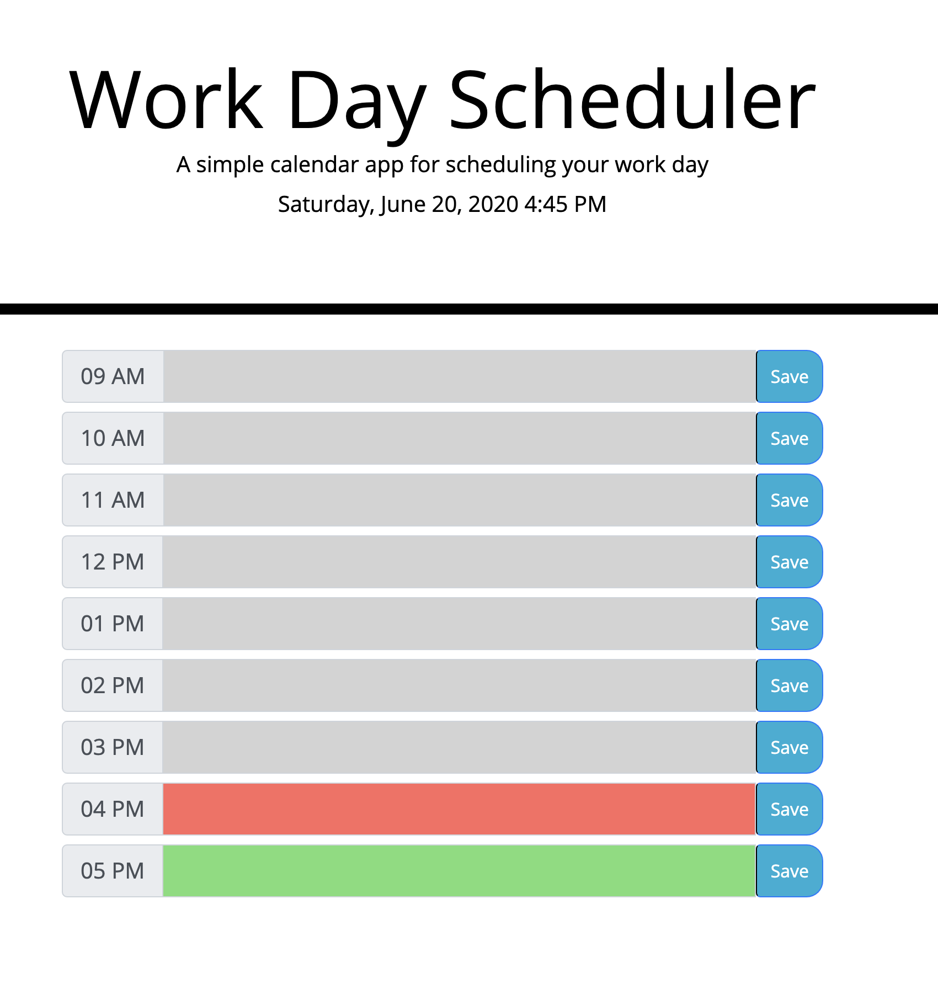

# Work Day Schedule

[JB BLOT - WORK DAY SCHEDULE](https://jaaybe.github.io/Work-Day-Scheduler/)

## Description
I've created a simple calendar application that allows a user to save events for each hour of the day. This app runs in the browser and features dynamically updated HTML and CSS powered by jQuery.

## Technology Used
<ul>
<li>git</li>
<li>HTML</li>
<li>CSS</li>
<li>Javascript</li>
<li>JQuery</li>
<li>Bootstrap</li>
<li>Moment.js</li>